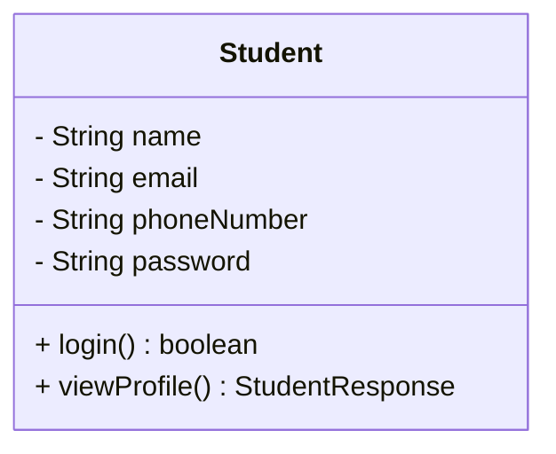
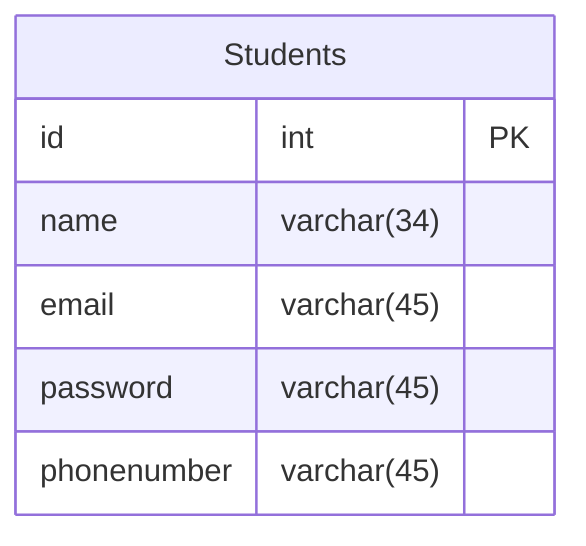

# CODE INSTITUTE

- [Home](../../../../../../README.md)

## CONTENTS

- [CODE INSTITUTE](#code-institute)
  - [CONTENTS](#contents)
    - [version-1](#version-1)
      - [USECASE Diagram](#usecase-diagram)
      - [Class Diagram](#class-diagram)
      - [Schema Design](#schema-design)

### version-1

Following are the requirements of the Institute application:

• A **student** should be able to login with their **email address** and **password**.
• Students should be able to view their profile which includes their **name**, email address and **phone number**.

#### USECASE Diagram

#### Class Diagram

#### Schema Design

