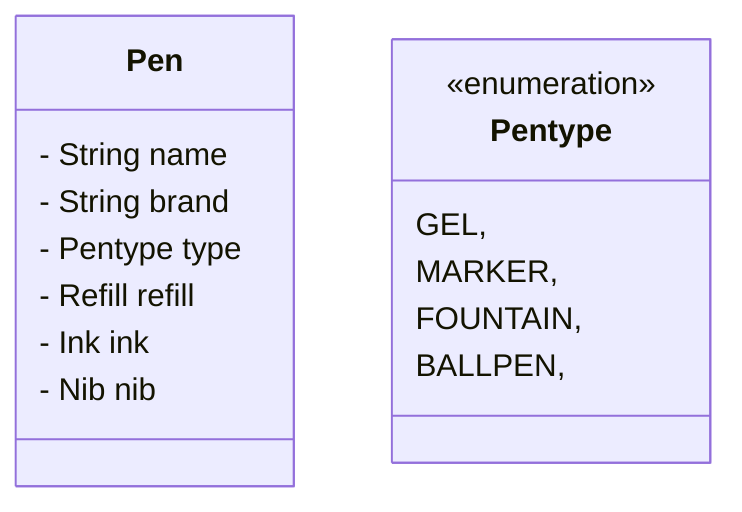
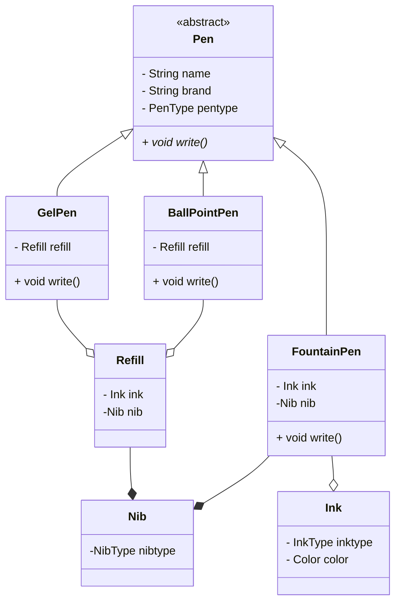
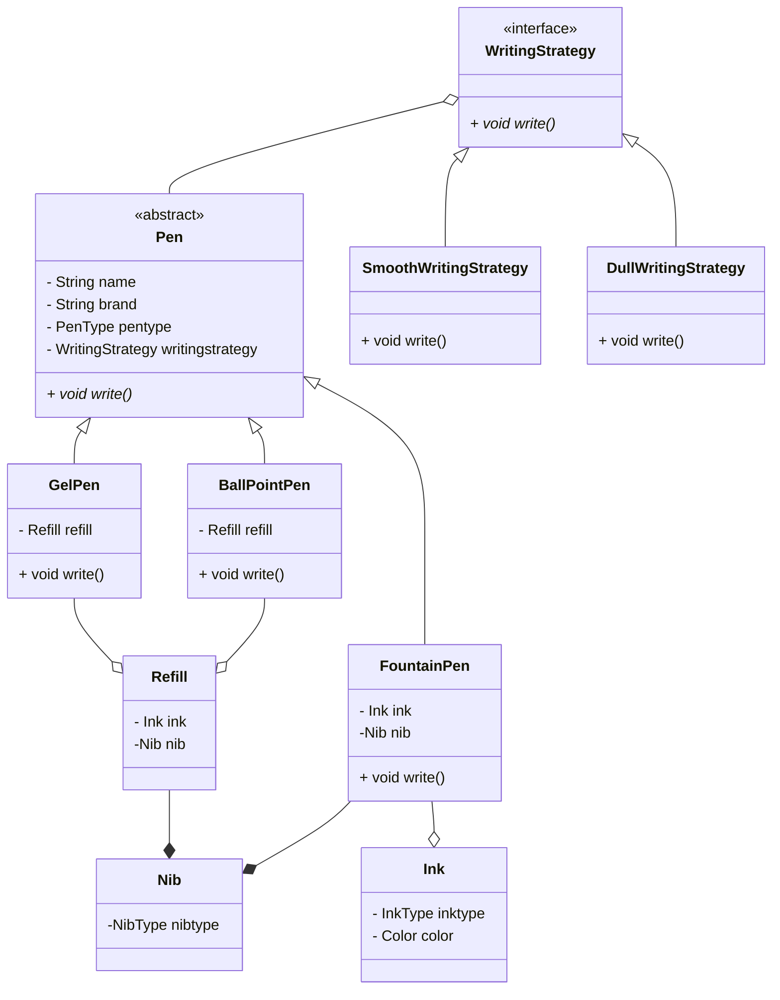

# PEN

- Pen is which can write
- Pen will have name, brand
- Pen can have Refill or Ink
- Some Pens can be Refillable.

- Here there are many problems, if we take fountain pen it doesn't have refill, and but it will have ink and nib.
- Whereas some pen has refill

so we solve by moving to child classes.

- Here we are implementing write method in each type of pen, but some pens are having same implementing, we are duplicating code.

To solve this problem we use strategy design pattern

So here we can change the writin strategy at run time also.

