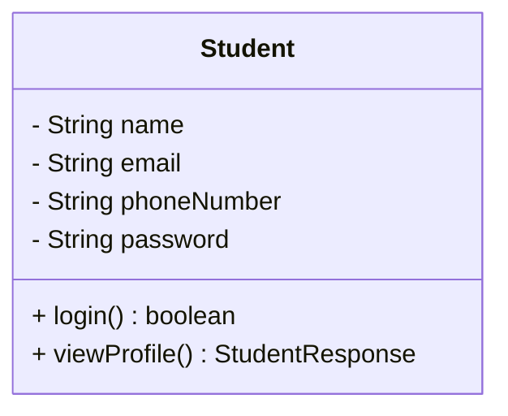
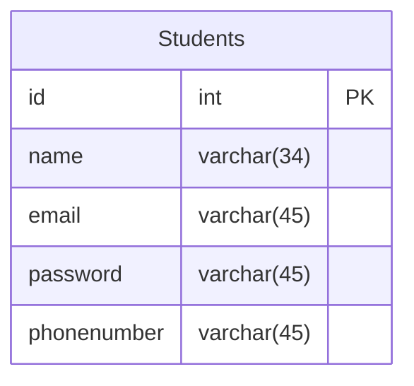
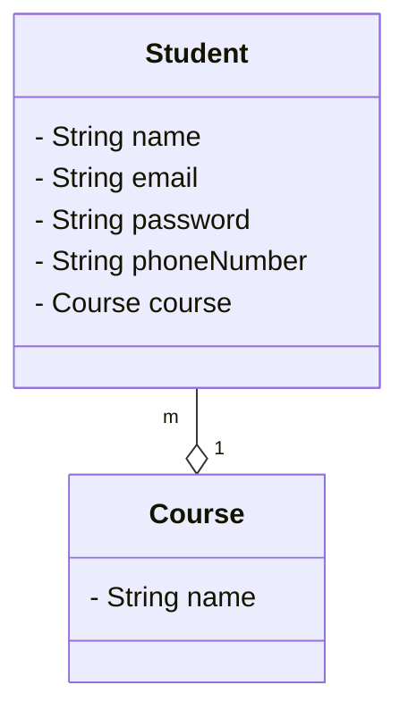
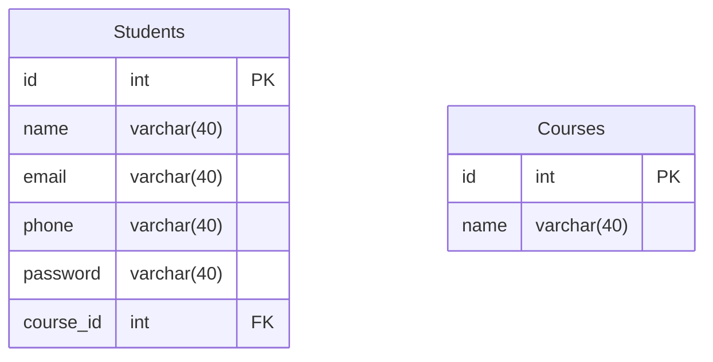
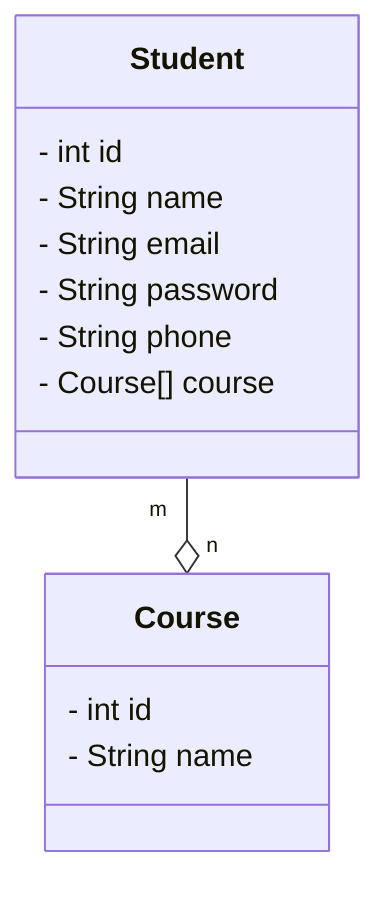
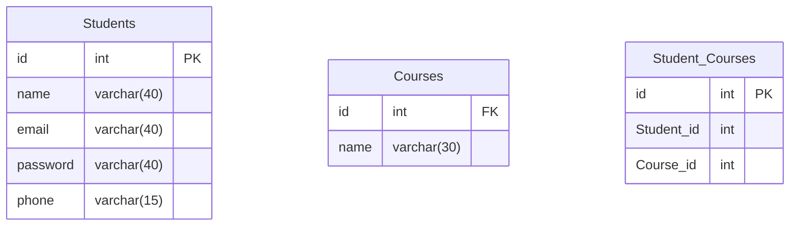
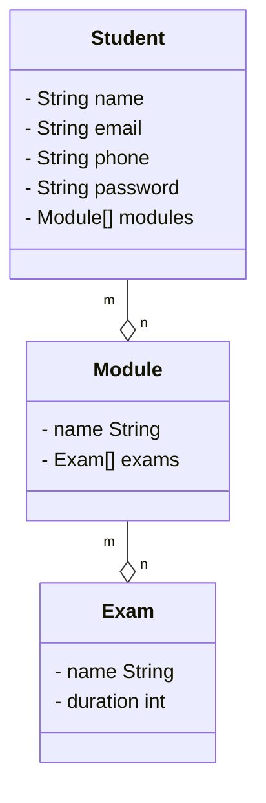
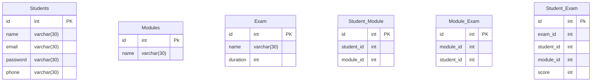

# CODE INSTITUTE

- [Home](../../../../../../README.md)

## CONTENTS

- [CODE INSTITUTE](#code-institute)
  - [CONTENTS](#contents)
    - [version-1](#version-1)
      - [USECASE Diagram](#usecase-diagram)
      - [Class Diagram](#class-diagram)
      - [Schema Design](#schema-design)
    - [Version-2](#version-2)
      - [Usecase Diagram](#usecase-diagram-1)
      - [Class Diagram](#class-diagram-1)
      - [Schema Design](#schema-design-1)
    - [Version-3](#version-3)
      - [UseCase Diagram](#usecase-diagram-2)
      - [Class Diagram](#class-diagram-2)
      - [Schema Diagram](#schema-diagram)
    - [Version-4](#version-4)
      - [Class Diagram](#class-diagram-3)
      - [Schema Design](#schema-design-2)

### version-1

Following are the requirements of the Institute application:

- A **student** should be able to login with their **email address** and **password**.
- Students should be able to view their profile which includes their **name**, email address and **phone number**.

#### USECASE Diagram

#### Class Diagram

#### Schema Design

### Version-2

- We will provide multiple courses as a part of the Institute application.
- Every student can enroll for a single course.
- Every course has a name.

#### Usecase Diagram

#### Class Diagram

#### Schema Design

### Version-3

- Each student can enroll for exactly 4 courses

#### UseCase Diagram

#### Class Diagram

#### Schema Diagram

### Version-4

- Institute will provide different **modules** for students to learn i.e. Data Structures, Algorithms, etc.
- Each **student** can enroll for **multiple modules**.
- Each **module** will have **multiple exams**.
- Each **exam** has a **name** and a **duration**.
- One **exam** can be part of **multiple modules**.
- For each **exam**, the **student** will be given a **score**.

#### Class Diagram

#### Schema Design

